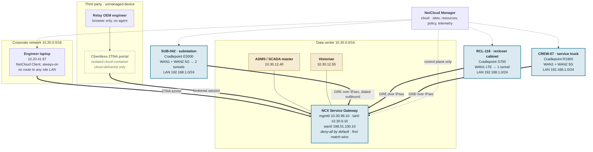
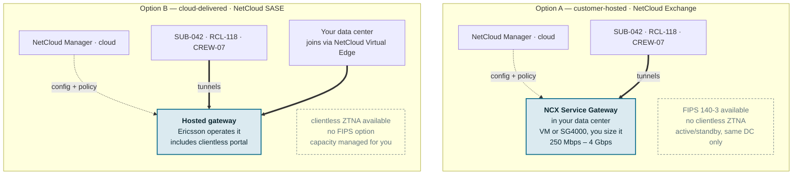
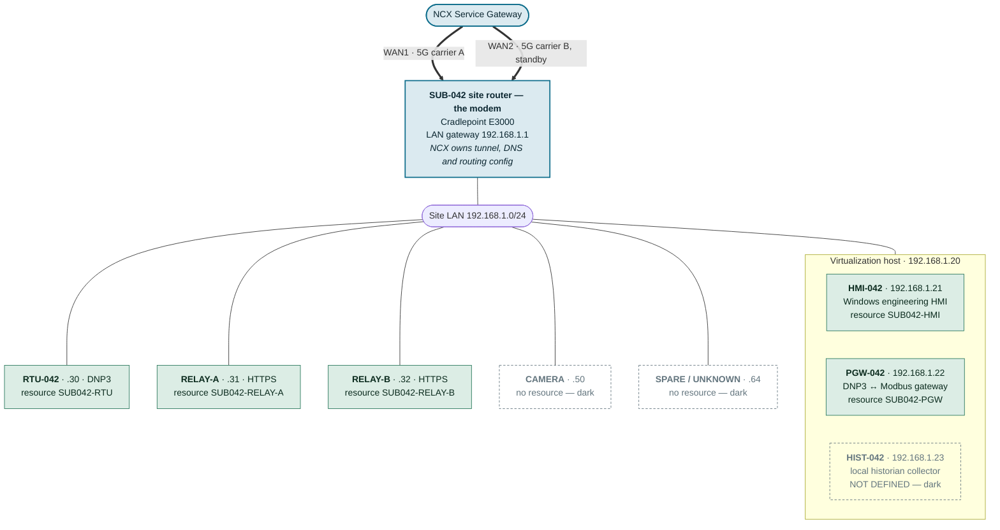
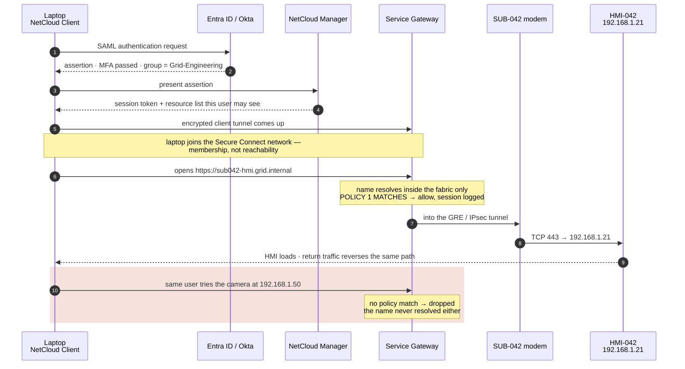
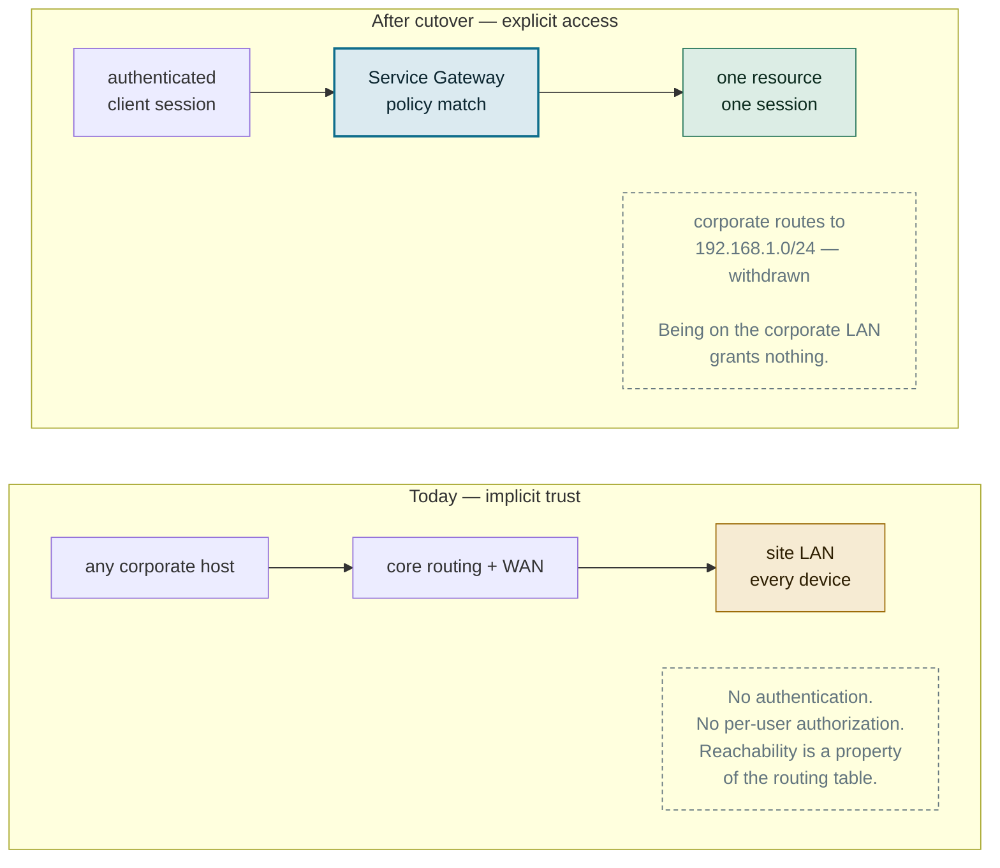

# NCX Grid Access — Mermaid diagrams

Mermaid versions of the five drawing sheets in
[`ncx-grid-access-design.html`](ncx-grid-access-design.html). These render inline on
GitHub, in VS Code's markdown preview, and anywhere else Mermaid is supported — useful
for pasting into tickets, wikis, or a design review deck.

The HTML version stays the reference drawing; these are the portable copies.

---

## 1. System topology

Every modem dials outbound to the Service Gateway. Nothing routes inbound. NetCloud
Manager reaches every device for configuration and telemetry and carries none of the
traffic below.

---

## 2. Where the gateway lives

NetCloud Manager is always cloud. The choice is where the **Service Gateway** runs, and
it decides which features you get.

**The conflict to settle before buying:** isolated agentless vendor access is
cloud-delivered only; FIPS and an on-premises data plane are customer-hosted only.

---

## 3. Under the modem — SUB-042 detail

VMs behind the modem are addressed exactly like physical gear. What separates a
reachable VM from a dark one is one entry in NetCloud Manager, not anything about the
hypervisor.

> Devices on this LAN still talk to each other freely. NCX segments the way in, not the
> inside — intra-site separation is still VLANs and local firewall rules.

---

## 4. Desk to substation HMI

The sequence that replaces "it just works because we're in the office." Steps 1–7 are
identical from the office, from home, and from a truck.

---

## 5. Before and after cutover

Standing up the fabric changes nothing on its own. Until the legacy route is withdrawn,
both doors are open and you have a second network rather than a private one.

**Prove it one site at a time.** Withdraw the legacy route for SUB-042 only and run a
full monthly cycle — including a planned outage and an after-hours callout — before
touching the second site. The test that matters is not "can the engineer get in," it is
"did anything quietly depend on the flat path that nobody documented."
